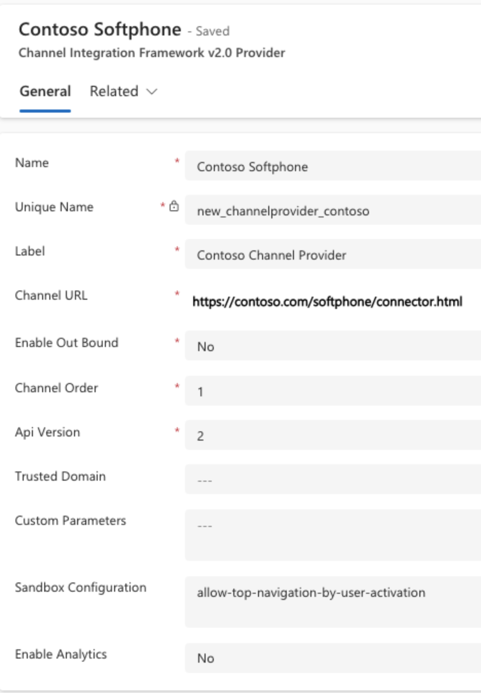

# Configure channel providers in Dynamics 365 Channel Integration Framework 2.0

Dynamics 365 Channel Integration Framework 2.0 is intended for multisession applications such as Omnichannel for Customer Service and Customer Service workspace. You can configure channel providers for multisession applications either using Customer Service admin center or Power Apps.

More information: 
- [Agent experience profiles](../../../customer-service/administer/overview.md)
- [Customer Service admin center](../../../customer-service/implement/cs-admin-center.md)

## Configure a third-party channel provider

1. Go to the Customer Service admin center, and perform the following steps
   
    1. In the site map, select **Workspaces** in **Agent experience**. The **Workspaces** page opens.
    
    2. Select **Manage** for **Third party voice channel provider**.
    
    3. Select a provider from the **Active Channel Providers** list and select **Edit**, or select **New** to add a new channel provider.
2. Enter or update the following details:

| Field | Description |
|-------|-------|
|Name|Name of the channel provider.|
|Unique Name|A unique identifier in the <*prefix*>_<*name*> format.  **IMPORTANT:** The following are required for the unique name:<ul><li> The prefix has to be alphanumeric with a length of 3-8 characters.</li><li>The prefix must include an underscore</li></ul>|
|Label|The label is displayed as the title on the widget.|
|Channel URL|The URL of the provider to host in the widget. See the JavaScript APIs on how to develop communication widget with Dynamics 365 Channel Integration Framework. If the URL isn't in the specified format, the application displays a warning. Select **Restore** to reset the URL to the expected value. |
|Enable Outbound Communication|Selecting a phone number in the Dynamics 365 Unified Interface page, the widget initiates the call or outbound communication.|
|Channel Order|The order of precedence of the channel providers. That is, the priority to display the channel for the agents and Unified Interface apps.|
|Api Version|The version of the Channel Integration Framework APIs.|
|Trusted Domain| An additional domain if the initial landing URL and the final domain from which the communication widget is hosted are different. Add the domain (URL) to access the Channel Integration Framework APIs. |
|Custom Parameters|This takes a text blob as input and `Microsoft.CIFramework.getEnvironment` will return this as value of key `customParams`.|
|Sandbox Configuration| Channel URL loads as an iFrame webresource in the sandbox mode. Use this field to configure the list of sandbox attributes for the Channel URL. You can add multiple attributes separated by commas.|
|Enable Analytics|Select `Yes` if you'd like to enable analytics for your channel provider.|

  > 

  > [!NOTE]
  > - Sandbox attributes such as allow-forms, allow-popups, allow-scripts, allow-same-origin, allow-modals, allow-downloads are configured by default.
  > - The **Restore** button is available only for forms with the **Unique Name** set to **msdyn_omnichannel**.
  > - The `Api Version` field is set to `2` when you navigate from the Agent Experience Profile.

3. Select **Save & Close**.

## Deactivate or delete a channel provider

1. In the site map of Customer Service admin center, select **Workspaces** in **Agent experience**. The **Workspaces** page opens.
    
2. Select **Manage** for **Third party voice channel provider**.
    
3. Select a provider from the **Active Channel Providers** list, and do one of the following:

    - To deactivate the channel provider, select **Deactivate**. In the **Confirm Deactivation** dialog, select **Yes**. You can reactivate the channel later by selecting **Activate**.
    - To delete the channel provider, select **Delete**. In the **Confirm Deletion** dialog, select **Yes** if you're sure you want to delete the channel provider. Note that you can't reactivate the channel provider after it's deleted.

### See also

[Overview of agent experience](../../../customer-service/administer/overview.md)  
[Enable outbound communication (ClickToAct)](../../v1/administer/enable-outbound-communication-clicktoact.md)  
[Microsoft.CIFramework.getEnvironment](../develop/reference/microsoft-ciframework/getEnvironment.md)  

[!INCLUDE[footer-include](../../../includes/footer-banner.md)]
