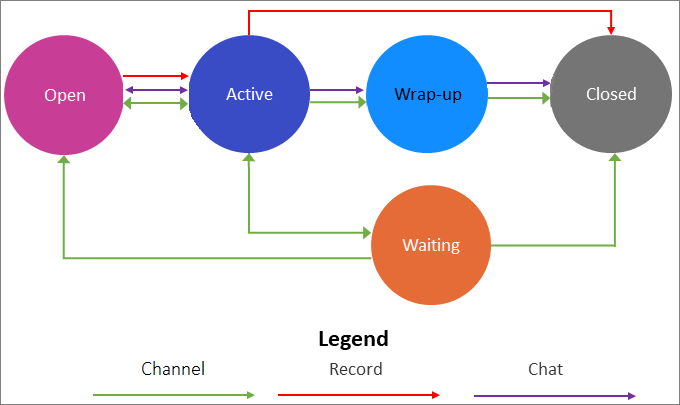

# Understand conversation states

[!INCLUDE[cc-use-with-omnichannel](../includes/cc-use-with-omnichannel.md)]

This article explains the various states and status reasons of the conversation (work item) in Omnichannel for Customer Service.

The conversation can be in an open or closed state, and can have the following status reasons:

- [Open](#open)
- [Active](#active)
- [Waiting](#waiting)
- [Wrap-up](#wrap-up)
- [Closed](#closed)

 

 *Channel* refers to SMS, voice, social, and Microsoft Teams channels supported in Omnichannel for Customer Service.

> [!NOTE]
> Additionally, the conversation might have the resolved or scheduled status reason, which is for internal use only.

## Open

The conversation (work item) that is in the queue and not assigned to the agent is classified under **Open** state.

The conversation (work item) transitions from **Open** to **Active** or **Closed** under the following scenarios.

| From status reason | To status reason | Scenario  | Type |
|---------------|------------------|---------------------------------------------------------|------------|
| Open          | Active           | An agent picks the conversation from the **Open work items** stream.   When the routing and work distribution feature pushes (assigns) the conversation to the agent. | Channel  Chat|
| Open          | Closed           | The customer disconnects or ends the chat before the conversation is assigned to the agent. More information: [Understand disconnected chats](oc-conv-state-chat-disconnect.md)| Chat |

## Active

The conversation that an agent picks or is assigned to the agent is classified under **Active**. In **Active**, the agent capacity is consumed.

The conversation (work item) transitions from **Active** to **Closed**, **Open**, **Waiting**, or **Wrap-up** under the following scenarios.

| From status reason | To status reason | Scenario  | Type  |
|---------------|------------------|---------------------------------------------------------|------------|
| Active        | Wrap-up          | An agent selects the **End** button on communication panel during the conversation with the customer.    When customer ends the conversation by selecting the **End** button on the portal chat widget (only for a chat channel).    When the customer is disconnected from the conversation (applicable only to Live chat channel).| Channel    Chat|
| Active        | Open             | An agent disconnects the conversation and doesn't reconnect within a specified timeout period.    When an agent releases the conversation to the queue.    When an agent transfers the conversation to another queue.    When an agent closes the session while the conversation is active (applicable only to Live chat channel). | Channel    Chat |
| Active        | Waiting          | An agent closes the session (not ending the conversation by selecting the **End** button) while the conversation is active.|  Channel    The status change isn't applicable to Live chat. | 
| Active | Closed | An agent resolves the case (or get a record to nonactive state) and closes the session. | Record |

## Wrap-up

The wrap-up state is an intermediate state after the agent ends the conversation and does post-conversation activities, such as taking notes and updating the customer information, before moving the conversation to the **Closed** state. In the **Wrap-up** state, the agent capacity is blocked according to the duration that the agent selects in the **Block capacity for wrap up** field in the workstream. If the agent selects **Always block**, their capacity is blocked as long as the conversation is in the **Wrap-up** state. If the **Don't block** setting is selected, the agent capacity is released as soon as conversation moves from **Active** to **Wrap-up** state. The agent might also select a duration that ranges from 1 to 60 minutes. More information: [Configure work distribution](create-workstreams.md#configure-work-distribution)

The conversation (work item) transitions from **Wrap-up** to **Closed** under the following scenario.

| From status reason | To status reason | Scenario  | Type  |
|---------------|------------------|---------------------------------------------------------|------------|
| Wrap-up       | Closed           | The agent selects the **End** button in communication panel and closes the session. | Channel    Chat|

> [!NOTE]
> When a live chat conversation gets disconnected, Omnichannel for Customer Service will automatically move **Active** conversations to the **Wrap-up** state. More information: [Understand disconnected chats](oc-conv-state-chat-disconnect.md)

## Waiting

> [!NOTE]
> Waiting state applies only to asynchronous and persistent chats, and not live chats.

A conversation in waiting doesn't block their capacity. The conversation gets transitioned to waiting when the agent closes the session without ending the conversation (that is, without selecting the **End** button on the communication panel) or when the customer closes the browser window without closing the chat widget. For example, the agent waits for some information from customer and doesn't want to end the conversation, or the customer's browser closes unexpectedly.

The conversation (work item) transitions from **Waiting** to **Closed**, **Active**, or **Open** under the following scenarios.

| From status reason | To status reason | Scenario  | Type |
|---------------|------------------|---------------------------------------------------------|------------|
| Waiting       | Closed           | There's no activity on this conversation from either customer or agent, within inactivity timeout period. | Channel  |
| Waiting       | Active           | An agent revives the session from the **My work items** stream on **Omnichannel Agent Dashboard**. | Channel |
| Waiting       | Open             | The customer revives the conversation within a specified timeout period while the session is still active in the browser. | Channel |

## Closed

The conversations that are completed by ending them or closing the session are classified as **Closed** conversations. Agents can't reactivate or reopen closed conversations.

### See also

[View communication panel](oc-conversation-control.md)  
[Configure automatic closure of conversations](auto-close-conversation.md)  
[Configure automatic closure of conversations using Power Apps](auto-close-conversation-powerapps.md)

[!INCLUDE[footer-include](../includes/footer-banner.md)]
