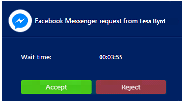
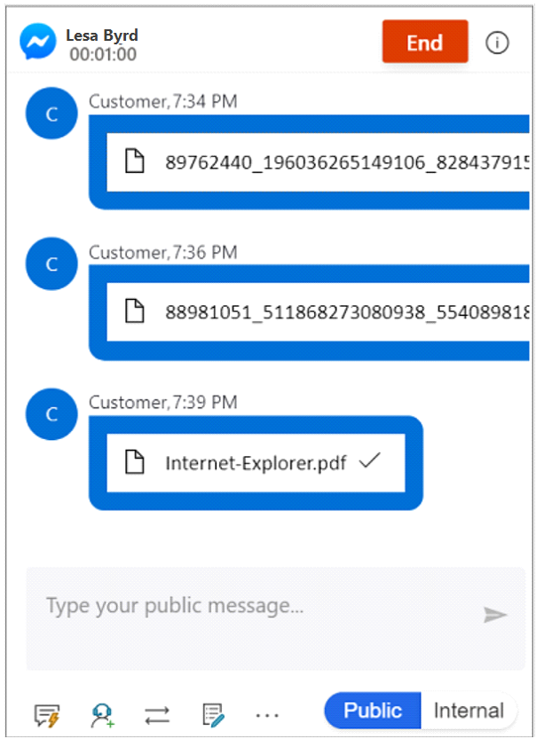

# Use Facebook channel

[!INCLUDE[cc-use-with-omnichannel](../../includes/cc-use-with-omnichannel.md)]

## Facebook channel overview

When you sign in to Omnichannel for Customer Service, you can see your work items in Omnichannel Agent Dashboard. To learn more, see [View agent dashboard and agent conversations (work items)](oc-agent-dashboard.md).

## Prerequisite

Make sure your administrator has configured a Facebook channel.

### Incoming Facebook notification

You'll receive a notification when a customer requests a Facebook conversation. Accepting the Facebook request starts a session and you'll see the communication panel in which you can exchange messages with the customer.

> [!div class=mx-imgBorder]
> 

In Omnichannel for Customer Service, you can:

- [View customer information on Active Conversation form](oc-customer-summary.md)
- [View communication panel](oc-conversation-control.md)
- [Use call options and visual engagement in live chat](call-options-visual-engagement.md)
- [Monitor real-time customer sentiment](oc-monitor-real-time-customer-sentiment-sessions.md)
- [Manage sessions](oc-manage-sessions.md)
- [Manage applications](oc-manage-applications.md)
- Use productivity tools
    - [Use agent scripts](oc-agent-scripts.md)
    - [View Smart assist](oc-smart-assist.md)
    - [Use productivity pane](../administer/productivity-pane.md)
- [Create a record](oc-create-record.md)
- [Search, link, and unlink a record](oc-search-link-unlink-record.md)
- [Search for and share knowledge articles](../oc-search-knowledge-articles.md)
- [Take notes specific to conversation](oc-take-notes.md)
- [Understand conversation states](oc-conversation-state.md)
- [Manage presence status](oc-manage-presence-status.md)
- [Search for transcripts](oc-search-transcipts.md)
- [View conversation and session forms](oc-view-activity-types.md)
- [View active conversations for an incoming conversation request](oc-view-customer-summary-incoming-conversation-request.md)
- [Search for transcripts](oc-search-transcipts.md)

## Send and receive file attachments

You can send file attachments to customers during a Facebook channel conversation. Before you send a file, make sure you understand the file size limit and file extension types set by your administrator. 

You can see the files that you receive from a customer on the communication panel. To view the file, select it and save it to your computer. The file name you see on an image that was sent by a customer might not reflect the actual file name, but a randomly generated number.

   > [!div class=mx-imgBorder]
   > 

If a customer sends an unsupported file extension type, you will see an error message in the communication panel: **Error: Customer sent an unsupported message type**.

### Send a file

To send a file, follow these steps:

1. Select the ellipsis (...) in the communication panel.

2. Select **Attach file**. A window will be displayed.

3. Browse and select the file to send it.

    > [!div class=mx-imgBorder]
    > 

To learn more about the Facebook channel setup, see [Configure a Facebook channel](../administer/configure-facebook-channel.md).

## Privacy notice

Customers are solely responsible for using Dynamics 365, this feature, and any associated feature or service in compliance with all applicable laws, such as laws relating to monitoring, recording, and storing communications with their end users. This includes adequately notifying end users that their communications with agents may be monitored, recorded, or stored and, as required by applicable laws, obtaining consent from end users before using the feature with them. Customers are also encouraged to have a mechanism in place to inform their agents that their communications with end users may be monitored, recorded, or stored.

### See also

[Configure a Facebook channel](../administer/configure-facebook-channel.md)

[!INCLUDE[footer-include](../../includes/footer-banner.md)]
